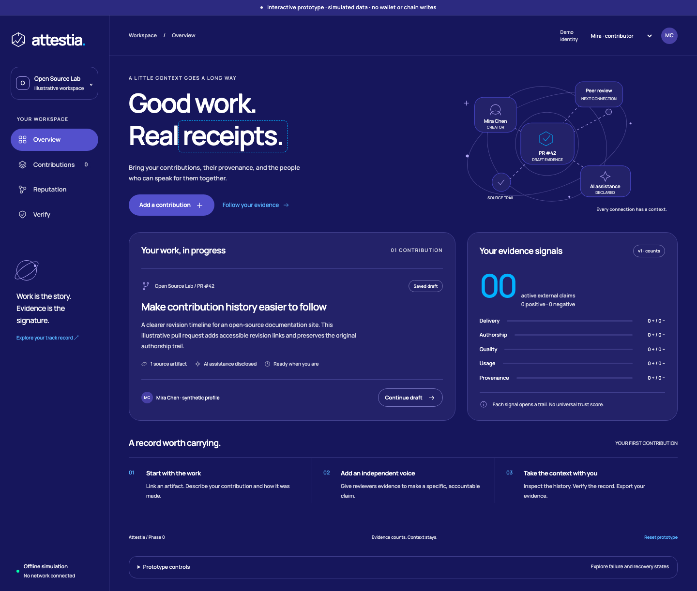

# Attestia

## What it does

Attestia is a contribution attestation platform designed to help people document their work, disclose human and AI provenance, and collect evidence-backed claims from reviewers.

The Phase 2 application lets contributors publish public evidence, disclose provenance, invite reviewers, receive or revoke attestations, annotate disputes, and verify records against Monad Testnet. Phase 0 specifications and Phase 1 contracts remain in the same repository.

See the [Phase 0 guide](docs/phase-0/README.md) for specifications, architecture, and research. The former Phase 0 interview, partner-commitment, and privacy-review exit gates are deprecated and non-blocking.
See the [Phase 1 guide](docs/phase-1/README.md) for contract scope, acceptance status, and deployment gates.

## How to run

Prerequisites: **Node.js 22+**, **pnpm 10.32.1**, **Foundry 1.8.0**, and the Phase 2 service credentials listed in [`.env.example`](.env.example).

```sh
git clone https://github.com/aldidstn/attesia.git
cd attesia
pnpm install --frozen-lockfile
cp .env.example .env
pnpm dev
```

Open **http://localhost:3000**. The Phase 0 wireflow remains available with `pnpm dev:phase0` at **http://127.0.0.1:4173/wireflow/**.

To run specification and browser checks:

```sh
pnpm exec playwright install chromium
pnpm test:phase2
```

Phase-specific TDD commands and the requirement coverage matrix are in [docs/TESTING.md](docs/TESTING.md).

## Demo

Run the application locally using the steps above. A hosted Phase 2 demo is pending account-backed acceptance.

1. Sign in through Privy and create a profile.
2. Draft a contribution, attach reviewed public evidence, and disclose provenance.
3. Publish it on Monad Testnet and invite a second Privy user.
4. Issue claims, revoke one, and inspect the indexed lifecycle.
5. Verify metadata and export the public integrity envelope without signing in.

Prototype controls also demonstrate rejected signatures, expired sessions, wallet mismatches, duplicates, inaccessible evidence, and indexer lag.



## Tech Stack

| Area | Current implementation |
| --- | --- |
| Interface | Next.js 16, React 19, TypeScript 5.9, Tailwind CSS 4, Radix primitives |
| Design | Violet surfaces, rounded panels, Manrope typography; [design reference](DESIGN.md) |
| Wallet and auth | Privy embedded/external wallets, HTTP-only app sessions, SIWE fallback, wagmi, viem |
| Application data | Supabase PostgreSQL through Drizzle ORM |
| Public evidence | Pinata IPFS uploads from server routes; text/Markdown/JSON up to 4 MB |
| Chain projection | Envio HyperIndex 3 with GraphQL reads and explicit freshness state |
| Specification | JSON Schema 2020-12, Ajv, ajv-formats |
| Integrity checks | RFC 8785 canonicalization, keccak256 metadata hashes, SHA-256 artifact hashes; canonicalize and @noble/hashes |
| Testing | Vitest, Playwright, axe-core, Foundry, Anvil |
| Tooling | Node.js and pnpm |
| Smart contracts | Solidity 0.8.28, Foundry 1.8.0, OpenZeppelin Contracts 5.6.1 |

Monad Testnet deployment, source verification, two-wallet Cast smoke checks, and direct issuer revocation are complete; see [deployment evidence](docs/phase-1/DEPLOYMENT.md).
Phase 2 implementation and its remaining account-backed acceptance gate are tracked in [docs/phase-2/STATUS.md](docs/phase-2/STATUS.md).
