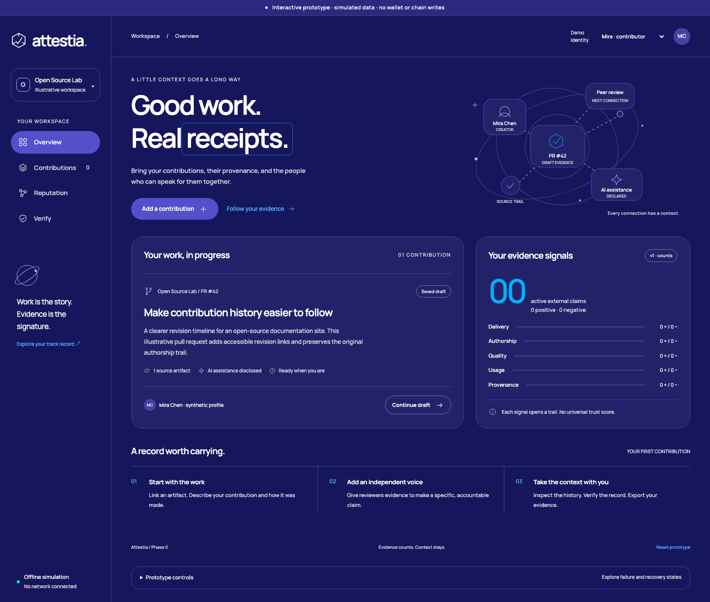

# Attestia

## What it does

Attestia is a contribution attestation platform designed to help people document their work, disclose human and AI provenance, and collect evidence-backed claims from reviewers.

The Phase 3 application lets contributors publish public evidence, collect claims, inspect category reputation and provenance graphs, register and discover ERC-8004 agents, publish declared agent policies, and browse a transparent contribution feed on Monad Testnet.

See the [Phase 0 guide](docs/phase-0/README.md) for specifications, architecture, and research. The former Phase 0 interview, partner-commitment, and privacy-review exit gates are deprecated and non-blocking.
See the [Phase 1 guide](docs/phase-1/README.md) for contract scope, acceptance status, and deployment gates.

Register an agent at `/agents/new`: sign in with Privy, review public metadata, and approve the Monad Testnet transaction using MON. The confirmed registry receipt supplies the agent ID; open it to link an Attestia profile. Registration creates an inactive identity, not a running AI service. No seed phrase or private key is requested.

## How to run

Prerequisites: **Node.js 22+**, **pnpm 10.32.1**, **Foundry 1.8.0**, and the Phase 2 service credentials listed in [`.env.example`](.env.example).

```sh
git clone https://github.com/aldidstn/attesia.git
cd attesia
pnpm install --frozen-lockfile
cp .env.example .env
cp apps/web/.env.example apps/web/.env.local
cp apps/indexer/.env.example apps/indexer/.env
pnpm dev
```

Open **http://localhost:3000**. The Phase 0 wireflow remains available with `pnpm dev:phase0` at **http://127.0.0.1:4173/wireflow/**.

To run specification and browser checks:

```sh
pnpm exec playwright install chromium
pnpm test:phase2
```

Phase-specific TDD commands and the requirement coverage matrix are in [docs/TESTING.md](docs/TESTING.md).

## Demo

The hosted Monad Testnet demo is available at [attesia.vercel.app](https://attesia.vercel.app). It has completed the account-backed two-user profile, contribution, attestation, revocation, indexing, and public-verification flow. Privy provides login and TEE-backed embedded wallets; each connected wallet pays its transaction fees in MON.

1. Sign in through Privy and create a profile.
2. Draft a contribution, attach reviewed public evidence, and disclose provenance.
3. Publish it on Monad Testnet and invite a second Privy user.
4. Issue claims, revoke one, and inspect the indexed lifecycle.
5. Inspect changed category signals and graph edges, then verify/export the public integrity envelope.
6. Resolve an ERC-8004 agent and inspect native feedback separately from Attestia claims.

Prototype controls also demonstrate rejected signatures, expired sessions, wallet mismatches, duplicates, inaccessible evidence, and indexer lag.



## Tech Stack

| Area | Current implementation |
| --- | --- |
| Interface | Next.js 16, React 19, TypeScript 5.9, Tailwind CSS 4, Radix primitives |
| Design | Violet surfaces, rounded panels, Manrope typography; [design reference](DESIGN.md) |
| Wallet and auth | Privy email/external-wallet login, TEE-backed embedded wallets, HTTP-only app sessions, SIWE fallback, wagmi, viem; wallets pay MON gas |
| Application data | PostgreSQL through Drizzle ORM; Supabase, Neon, or Vercel Marketplace Postgres |
| Public evidence | Pinata IPFS uploads from server routes; text/Markdown/JSON up to 4 MB |
| Chain projection | Envio HyperIndex 3; the Monad Testnet cloud indexer is active with GraphQL freshness and lifecycle reads |
| Reputation and graph | Deterministic `reputation-v1`, native SVG provenance graph, ERC-8004 Identity and Reputation Registry adapters |
| Specification | JSON Schema 2020-12, Ajv, ajv-formats |
| Integrity checks | RFC 8785 canonicalization, keccak256 metadata hashes, SHA-256 artifact hashes; canonicalize and @noble/hashes |
| Testing | Vitest, Playwright, axe-core, Foundry, Anvil |
| Tooling | Node.js and pnpm |
| Smart contracts | Solidity 0.8.28, Foundry 1.8.0, OpenZeppelin Contracts 5.6.1 |

Monad Testnet deployment, source verification, two-wallet Cast smoke checks, and direct issuer revocation are complete; see [deployment evidence](docs/phase-1/DEPLOYMENT.md).
Phase 2 implementation and its remaining account-backed acceptance gate are tracked in [docs/phase-2/STATUS.md](docs/phase-2/STATUS.md).
Phase 3 behavior, API, and acceptance evidence are tracked in [docs/phase-3/README.md](docs/phase-3/README.md).
