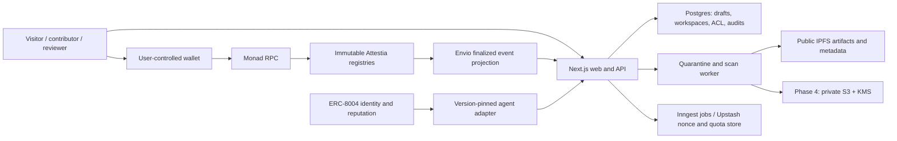

# Architecture and decisions

Status: Phase 0 specification, 5 September 2026. Components below are planned; only the local wireflow and specification checks exist. [SPECIFICATION.md](SPECIFICATION.md) defines metadata and contract semantics; [REQUIREMENTS.md](REQUIREMENTS.md) maps PRD obligations.

## System and trust boundaries



```mermaid
sequenceDiagram
  participant U as Contributor wallet/browser
  participant A as API + storage
  participant C as Monad contracts
  participant I as Indexer
  U->>A: Nonce-bound login; save private draft
  U->>A: Upload artifact and disclosure
  A->>A: Validate, scan, canonicalize and hash
  A-->>U: Publication review and digests
  U->>C: Sign reviewed registration
  C-->>U: Receipt (pending until finalized)
  C-->>I: Finalized event
  I->>I: Idempotent materialization + category counts
  I-->>A: Projection with source block and freshness
  A-->>U: Indexed record + verification envelope
```

Browser input, external URLs, wallet signatures, RPC results, metadata and indexer events are separate trust boundaries. The API does not replace chain authorization. A database entry cannot transfer ownership, revoke a chain claim, or imply finality.

## Decision log

| ID | Decision | Reason / consequence |
|---|---|---|
| ADR-01 | Next.js App Router + TypeScript, Tailwind/shadcn/Radix, wagmi/viem | Follow PRD stack; server reads by default, client components for wallet/form interactions. No app framework in Phase 0. |
| ADR-02 | Custom immutable registries rather than EAS-backed issuance | Bind contribution, rubric and supersession directly; avoid dependency on EAS deployment/upgrade availability. This owns more audited code. Preserve versioned metadata/API so an EAS-backed V2 remains possible; migration never rewrites V1 history. This is a product decision, not a claim that EAS lacks these generic capabilities. |
| ADR-03 | Anyone may issue; counts have no reviewer-quality weights | User choice. Membership controls workspace workflow and private evidence, not global issuance. Display eligibility and reciprocal clusters as context. |
| ADR-04 | Count positive/negative external claims separately, with dispute subsets | User choice supersedes earlier disputed-exclusion proposal. Counts are claims, not a universal trust verdict. Revoked/expired/superseded claims remain historical. |
| ADR-05 | Wallet-bound human profiles; owner/delegate authorization | No transfer or social recovery at launch. Snapshot issuer's self-relationship at issuance to make history reproducible. |
| ADR-06 | Explicit immutable revisions | Same-artifact metadata revision needs same creator-profile parent and changed metadata; duplicate roots or exact duplicate revisions cannot silently create another record. |
| ADR-07 | Public artifacts first, private evidence Phase 4 | Separate data classifications and storage paths. Do not publish private URIs, filenames, prompts or access tokens. See SECURITY. |
| ADR-08 | Identity from ERC-8004; declared policies in Attestia | Resolve current owner from pinned registry at write time. Never infer enforcement from a policy digest. Native feedback stays separate. |
| ADR-09 | Managed infrastructure, minimal integration boundaries | Vercel, Supabase Postgres, Envio, Pinata, Inngest, Upstash; S3/KMS in Phase 4. Managed adapters only at actual vendor boundaries. |
| ADR-10 | Wallet pays MON for every write | Product decision updated 2026-09-16. Privy provides login and TEE-backed embedded wallets; Attestia does not fund gas credits, add a paymaster, or operate a relayer. This keeps Monad fees explicit and preserves direct wallet authorization. |
| ADR-11 | Production negative issuance disabled | Testnet supports ±1. First production immutable registry rejects negative issuance; enabling later needs a separately reviewed deployment/version. Application moderation does not censor other protocols. Issuer revocation remains available. |
| ADR-12 | Attestia owns `attestia.counts.v1`; workspaces own immutable rubrics | No workspace-specific hidden scoring weights. Policy versions and source block identify every projection. |

## Public interface contract

Base `/api/v1`. IDs are returned with chain/registry context. Record routes require `chainId` and `registry` query parameters; nested lists inherit the parent scope. Agent routes carry chain ID in path and require the identity `registry` query parameter. Omitted scope may resolve only when the environment deployment manifest has exactly one matching namespace; otherwise return 400 `AMBIGUOUS_RECORD_SCOPE` with available public namespaces. Share/verify links always include scope, including after V2 deployment. Never interpret an unscoped bytes32 as globally unique. Decimal strings represent block numbers and uint256 agent IDs. Server validates schema and authorizes every mutation, including Server Actions.

| Route | Output / responsibility |
|---|---|
| `GET /profiles/{id}` | Public profile, category counts, confidence inputs and source envelope |
| `GET /profiles/{id}/contributions` | Cursor-paginated owned contributions |
| `GET /contributions/{id}` | Metadata, artifact integrity, provenance and revision history |
| `GET /contributions/{id}/attestations` | Issuance/lifecycle records, positive/negative outcomes, dispute annotations |
| `GET /agents/{chainId}/{agentId}` | Pinned registry identity, current owner, separate native feedback and declared policy |
| `GET /verify/{recordType}/{id}` | Profile/contribution/attestation integrity, chain reference, availability and freshness |
| `GET /feed?type=&community=&status=&cursor=` | Explainable ranking; also support `skill` and `actorType` filters |
| `POST /api/auth/nonce`, `/api/auth/verify`, `/api/auth/logout` | One-use nonce, SIWE-style session, explicit logout (outside `/api/v1`) |
| `POST /uploads/presign` | Authenticated quarantine upload, never automatic public pinning |
| `POST /contributions/draft` | Validated autosave/upsert with revision guard and idempotency key |
| `POST /review-invitations` | Seven-day scoped review link, no private file URL embedded |
| `POST /disputes` | Subject/admin evidence-backed annotation; no chain lifecycle mutation |
| `GET/POST /workspaces/{id}/reviewers`, `/rubrics` | Admin-only audited membership/version publishing |
| `GET /notifications`, `POST /notifications/{id}/read` | Recipient-only activity and read state |
| `POST /billing/checkout`, `/billing/portal`, `/billing/webhook` | Phase 6 Stripe sandbox; webhook uses provider signature, not wallet session |

These are specifications, not functioning Phase 0 API routes. Contribution/attestation writes are wallet-to-contract; API preparation does not hold user keys.

The PRD integrity envelope is retained: `data`, `source` (`chainId`, `contract`, `recordId`, `transactionHash`, decimal `blockNumber`, `confirmation`, `indexedAt`), and `score` (`algorithmVersion`, `computedAt`). Responses also expose metadata/artifact integrity separately and dispute snapshot time. Drafts lack chain source; they must never use a fabricated finalized envelope.

Public pagination: default 20, maximum 100; opaque cursor contains stable sort position and filters. Rate-limit defaults for pilot: 60 public requests/minute per IP, 30 authenticated mutations/minute per session; paid quotas belong to Phase 6. Return `429` with `Retry-After`. Immutable resources use ETags; private responses use `Cache-Control: private, no-store`. Validation returns field errors plus correlation ID, authorization returns 401/403, missing public record 404, duplicate/stale revision 409, dependencies unavailable 503. Error text contains no secrets.

## Data ownership, ordering and recovery

- Postgres holds drafts, upload scan results, workspaces/memberships, invitations, notifications, dispute audit events and algorithm snapshots. Unique constraints own nonce/idempotency/slug correctness; use transactions for consumption and version creation.
- Envio materializes events keyed by `(chainId, transactionHash, logIndex)` and ordered by block/transaction/log index. Store block hash, deployment manifest version and finality. Provisional events do not increase finalized counts.
- Onchain owner/lifecycle takes precedence. Offchain metadata must match digest before being presented as intact. A timeout is unavailable, never a successful integrity result.
- Store transaction hash immediately when available. When broadcast outcome is unknown, reconcile wallet nonce/known transaction and deterministic record ID before resubmission. Server idempotency alone cannot prevent wallet double broadcasts; contracts reject duplicate record IDs.
- Use expiry timers/jobs as well as chain events to recompute counts. Historical reconstruction takes ordered chain events, issuer relationship at issuance, as-of time, immutable rules and dispute audit cutoff.
- Contract ABI is generated into shared clients in Phase 1. Envio reads from recorded deployment blocks; APIs query projections rather than scanning historical logs per request.
- Mainnet manifest contains chain, address, deployment block/hash, compiler, source commit, ABI hash, runtime bytecode hash, registry dependency revision and negative-claim policy. No deployed Attestia manifest exists yet.

## Preliminary monthly cost model

Budget worksheet, not a quote or spending authorization. Assumed pilot: one workspace, 200 active people, 100 submissions/month, 5 MB mean artifact, two claims + one revoke per submission, 100 profile writes, 100,000 public reads, one production region. Public artifact growth ≈0.5 GB/month. Transaction gas is paid in MON by each connected wallet and is not an Attestia infrastructure expense.

| Cost line | Low USD/month | Higher USD/month | Evidence / qualification |
|---|---:|---:|---|
| Vercel Pro, one developer | 20 | 20 | Listed base; usage/taxes additional: [pricing](https://vercel.com/pricing), checked 2026-09-05 |
| Supabase Pro, one small project | 25 | 25 | Listed base; extra projects/compute additional: [pricing](https://supabase.com/pricing), checked 2026-09-05 |
| Pinata Picnic | 20 | 20 | Listed base; verify public-IPFS entitlement and overage at procurement: [pricing](https://pinata.cloud/pricing), checked 2026-09-05 |
| Envio hosting | 50 | 150 | Planning allowance; hosted quote unverified |
| Production RPC/fallback | 25 | 100 | Planning allowance; provider/usage quote pending |
| Queue + Redis | 10 | 40 | Planning allowance, not claimed vendor price |
| Monitoring/analytics | 0 | 30 | Planning allowance; free-tier eligibility not assumed for launch |
| Artifact scanner worker | 20 | 60 | Planning allowance; maintained scanner required before public uploads |
| Phase 4 S3/KMS/backup overhead | 5 | 20 | Planning allowance; region/request costs pending |
| **Subtotal** | **175** | **565** | Three observed base prices; six explicit estimates |
| Contingency, rounded up 25% | 44 | 142 | Includes uncertainty, not gas |
| **Budget envelope** | **219** | **707** | Plus taxes and payment fees |

Before launch, replace all allowances with quotes and load measurements. Measure user-visible gas for each write path and explain it before signature, but do not include user-paid MON in Attestia's operating budget. At hypothetical $49/workspace, infrastructure-only break-even is 5–15 paying workspaces before labor, support or fees; this arithmetic is not validated pricing or willingness to pay.
